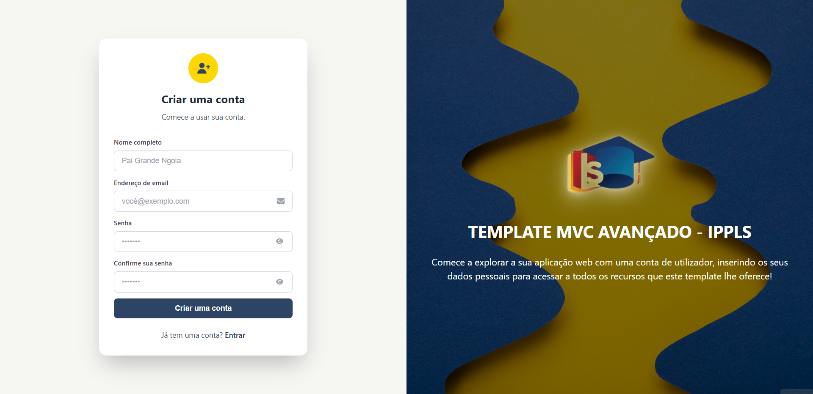

# 📚 Template Avançado MVC - IPPLS

<div align="left">

**Template de Padronização para Projetos Acadêmicos**

[](https://www.php.net/)
[](https://getcomposer.org/)
[](https://www.mysql.com/)
[](LICENSE)

[🚀 Instalação](#instalao) · [📖 Estrutura](#estrutura-do-projeto) · [💡 Criar Módulo](#criando-um-novo-mdulo) · [🐛 Problemas](#troubleshooting)

</div>

---

## <i class="fas fa-info-circle"></i> Sobre o Template

O **Template Avançado MVC - IPPLS** é uma solução profissional desenvolvida pelo **António Ambrósio Ngola** para ensinar e padronizar o desenvolvimento web, usando arquitetura MVC com foco no mercado de trabalho. Este template ajuda ao utilizador a se alinhar com boas práticas e profissionalismo na indústria de software, evitando perda de tempo no setup inicial de seus projetos de programação web. Explore o template apartir da documentação e sinta o poder dessa stack!

## 🚀 Características

- ✅ **URLs Amigáveis**: `/users` em vez de `?page=users`
- ✅ **Middleware**: Autenticação e CSRF
- ✅ **Upload de Arquivos**: Validação e armazenamento
- ✅ **Paginação**: Navegação automática de dados
- ✅ **API REST**: Endpoints JSON para integração
- ✅ **Múltiplos CRUDs**: Users, Products, etc.

## 📋 Requisitos

- PHP >= 8.0
- Composer >= 2.0
- MySQL >= 5.7
- Apache com mod_rewrite

## 🔧 Instalação

1. **Instalar dependências:**

```bash
composer install
```

> **Nota:** Arquivos e configurações de teste (PHPUnit / PHPStan) podem ser adicionados pelo próprio dev. Se quiser usar testes, adicione as dependências e os ficheiros manualmente.

2. **Criar banco de dados e tabelas:**

```sql
-- Template Avançado
CREATE DATABASE template_avancado;
USE template_avancado;
CREATE TABLE users (
    id INT AUTO_INCREMENT PRIMARY KEY,
    name VARCHAR(100) NOT NULL,
    email VARCHAR(100) NOT NULL UNIQUE,
    password VARCHAR(255) NOT NULL,
    created_at TIMESTAMP DEFAULT CURRENT_TIMESTAMP
);
CREATE TABLE products (
    id INT AUTO_INCREMENT PRIMARY KEY,
    name VARCHAR(100) NOT NULL,
    description TEXT,
    price DECIMAL(10,2) NOT NULL,
    image VARCHAR(255),
    created_at TIMESTAMP DEFAULT CURRENT_TIMESTAMP
);
```

## 🌱 Seeds (— facilita o início do desenvolvimento)

Para popular rapidamente a base de dados com dados de exemplo (usuários e produtos), use o script de seed incluído:

```bash
php scripts/seed.php
```

O script usa as variáveis de ambiente `DB_HOST`, `DB_NAME`, `DB_USER`, `DB_PASS` ou os valores padrão definidos em `app/config/database.php`.

Observações:

- O script cria as tabelas `users` e `products` caso não existam.
- Usuários e produtos com o mesmo email/nome não serão duplicados — o script verifica antes de inserir.
- As senhas de exemplo são inseridas como hashes resultantes de `password_hash()`; o script imprime as senhas em texto claro na saída apenas para conveniência local (não use em produção).

Se preferir popular via SQL manual, siga a seção "Inserir dados de testes (seguro)" abaixo.

2.1 **Inserir dados de testes (seguro)**:

As senhas devem ser armazenadas com `password_hash()` — não use funções MD5/SHA simples.

Opção A — SQL com senhas já geradas (substitua {HASH} pelos valores gerados em PHP):

```sql
USE template_avancado;
INSERT INTO users (name, email, password) VALUES
('Pai Grande Ngola', 'paigrandengola@gmail.com', '{HASH_FOR_password1}'),
('Kelson Filipe Dev', 'kelsonfilipedev@gmail.com', '{HASH_FOR_password2}');
```

Opção B — Gerar hashes rapidamente com PHP (exemplo):

```bash
php -r "echo password_hash('password1', PASSWORD_BCRYPT) . PHP_EOL;"
php -r "echo password_hash('password2', PASSWORD_BCRYPT) . PHP_EOL;"
```

Copie as strings geradas para o campo `password` nas suas queries de insert. Para popular produtos, use SQL normal:

```sql
INSERT INTO products (name, description, price) VALUES
('Laptop IPPLS', 'Computador portátil para estudantes', 150000.00),
('Mouse Wireless', 'Mouse sem fio ergonômico', 2500.00),
('Teclado Mecânico', 'Teclado para programadores', 8500.00);
```

## ⚡ Uso rápido

- Copiar `.env.example` para `.env` e ajustar se necessário:

```powershell
copy .\.env.example .env
```

# ou executar direitamente o script

```powershell
php scripts/env-setup.php
```

- Popular a base de dados com dados de exemplo:

```powershell
composer run seed
```

# ou executar direitamente o script

```powershell
php scripts/seed.php
```

Esses comandos são suficientes para deixar o ambiente pronto para explorar o template localmente.

## 📦 Composer scripts úteis

- `composer run seed` — executa `php scripts/seed.php` para popular o DB.
- `composer run env-setup` — cria `.env` a partir de `.env.example` (não sobrescreve se já existir).

## ✅ Boas práticas para devs iniciantes

- Nunca commite o arquivo `.env` em repositórios públicos.
- Use o script de seed apenas em ambientes de desenvolvimento; não rode em produção.
- Faça commits pequenos e claros; teste mudanças de DB localmente antes de enviar pull requests.
- Mantenha `APP_ENV=development` somente em dev; use `production` em servidores reais.

## 🔒 Notas de segurança e produção

- O template aplica proteção CSRF, `HttpOnly` e `SameSite` no cookie de sessão; em HTTPS o cookie `secure` é ativado automaticamente.
- Antes de levar para produção, remova dados de exemplo e valide configurações de `APP_URL` e credenciais.
- Considere adicionar logging estruturado (ex.: Monolog) e backups automáticos do banco de dados.

## 📈 Melhores próximas etapas (não obrigatórias)

- Adicionar uma pequena `Request` helper para centralizar leitura de `$_GET/$_POST` e validação.
- Introduzir validação centralizada (ex.: usar Respect/Validation ou criar helpers) para evitar duplicação.
- Configurar CI simples (GitHub Actions) que rode um conjunto mínimo de verificações (lint, composer install).

3. **Configurar banco:**

```php
// app/config/database.php
DB_HOST = 'localhost';
DB_NAME = 'template_avancado';
DB_USER = 'root';
DB_PASS = '';
```

4. **Acessar:**

```bash
http://localhost/template_avancado
```

## 📚 URLs Disponíveis

### Web

- `/` - Home
- `/users` - CRUD de usuários
- `/products` - CRUD de produtos
- `/docs` - Documentação
- `/dashboard` - Dashboard (protegido)
- `/login` - Login
- `/register` - Registro
- `/logout` - Logout do usuário
- `/auth/login` - Processar login (POST)
- `/auth/register` - Processar registro (POST)

### API

- `GET /api/users` - Listar usuários
- `GET /api/users/{id}` - Buscar usuário
- `POST /api/users` - Criar usuário
- `PUT /api/users/{id}` - Atualizar usuário
- `DELETE /api/users/{id}` - Deletar usuário

## 🔐 Sistema de Autenticação Premium

### Design Moderno e Responsivo

O template inclui páginas de **Login** e **Registro** com design premium split-screen:

- ✅ **Layout Responsivo**: Adapta-se perfeitamente a desktop, tablet e mobile
- ✅ **Validações em Tempo Real**: Feedback imediato ao usuário
- ✅ **Mostrar/Ocultar Senha**: Botão de visualização de senha
- ✅ **Design de tela dividida**: Formulário à esquerda, imagem inspiracional à direita
- ✅ **Animações Sutis**: Transições suaves e efeitos hover
- ✅ **Ícones Font Awesome**: Interface visual moderna

### 📸 Telas de Autenticação

#### Página de login

<div>
    
</div>

#### Página de registo

<div>
    
</div>

### 🔐 Segurança Implementada

- ✅ **CSRF Protection**: Tokens em todos os formulários
- ✅ **Password Hashing**: Senhas criptografadas com `password_hash()`
- ✅ **Input Sanitization**: Função `clean()` para prevenir XSS
- ✅ **Validação Dupla**: Client-side (JavaScript) e Server-side (PHP)

### 📝 Integração com Banco de Dados

As páginas já estão preparadas para integração. Veja o guia completo em:

```
docs/auth-integration.md
```

### 🎯 Próximos Passos

1. Implementar lógica de banco de dados no `AuthController`<br>
2. Adicionar recuperação de senha<br>
3. Configurar envio de emails de verificação<br>
4. Implementar "Lembrar-me" (Remember Me)<br>
5. Adicionar autenticação de dois fatores (2FA)

---

**Design Premium desenvolvido especialmente para o Template Avançado MVC - IPPLS** ✨

## 🎯 Progressão dos Templates

| Recurso        | Base | Padrão | **Avançado** |
| -------------- | ---- | ------ | ------------ |
| URLs Amigáveis | ❌   | ❌     | ✅           |
| Middleware     | ❌   | ❌     | ✅           |
| Upload         | ❌   | ❌     | ✅           |
| Paginação      | ❌   | ❌     | ✅           |
| API REST       | ❌   | ❌     | ✅           |

---

**Desenvolvido com ❤️ para o IPPLS**
